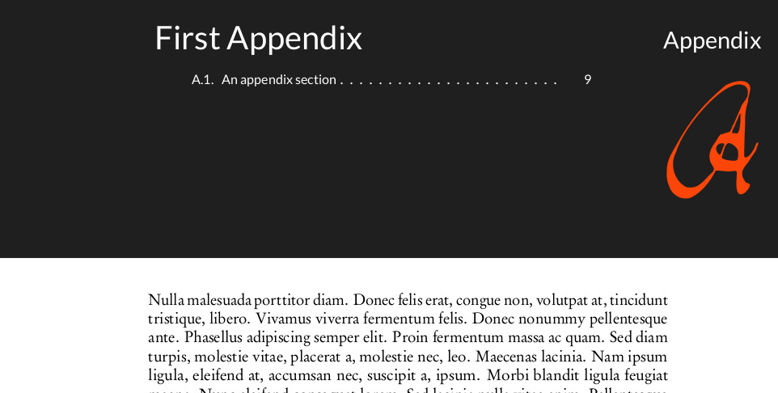

# Naranja LaTeX template

Naranja is a LaTeX class for reports, theses, etc.  This repository includes an
`example_report.tex` file as a template to start using the class. 
A [PDF file](pdf/report_example.pdf) with the compiled `tex` file is in the
`pdf` folder.

To compile the example just run `make`.

## Fonts

This class uses `URW garamond` for the main text and maths. This font ca be
installed from a `lua` script in
.  Download it and run it with: 

    texlua install-getnonfreefonts

assuming you have TeXLive installed.

If you want to use the normal Modern LaTeX fonts, just comment the 

    % \renewcommand{\rmdefault}{ugm}
    % \renewcommand{\sfdefault}{ugm}
    % \usepackage[urw-garamond]{mathdesign}

lines in `naranja.cls`.

In addition, `lato` fonts are used for the headings. Future versions of
`naranja.cls` might use this font for the main text.

## Requirements

`naranja` is based on `komascript` with `tocstyle`. It seems `tocstyle` can
change in the future so this dependency might be updated in future versions of
the template. 

I suggest to compile a report that uses this class, using a recent version of
TeXLive, since packages as `lato` fonts are not available in old TeXLive
versions. The following is a list of packages used in `naranja.cls`:

    komascript      % base class 
    scrlayer        % chapter styling
    aurical         % font for chapter numbers
    ugm             % urw gramond font for main text
    textcomp        % text symbols
    lato            % font for headings
    tocstyle        % for table of contents. It comes with komascript
    tocbibind       % bibliography at the TOC
    minitoc         % mini table of contents in chapter heading
    amsmath
    colortbl        % colours for tables
    makecell        % tables
    hyperref        % links
    cite
    caption
    array
    geometry
    tikz
    tikzpagenodes
    pdfpages
    etoolbox
    
In Linux, different distributions have `extra` TeXLive packages to easily get
most of the dependencies for this class.

## TODO

* Figure and table labels should be at the right or left side according
  if the page is odd or even
* Update table of contents or `tocstyle`
* Update to a sans serif font (?)
